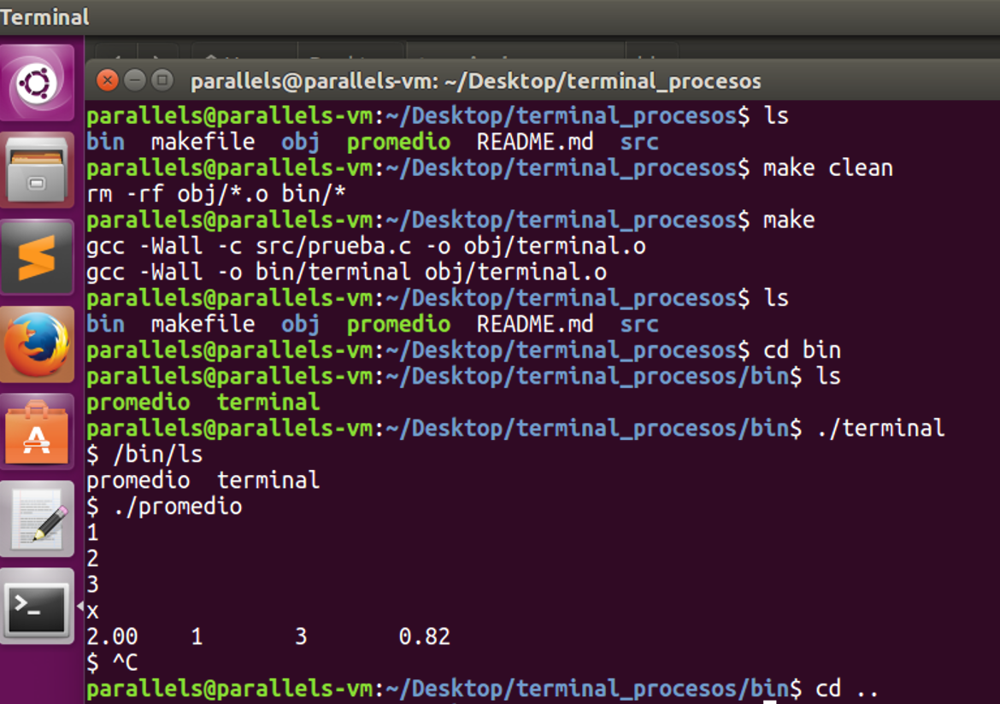

# procesos_terminal
Terminal, permite ejecutar programas. Llamadas fork, execl y wait.

Se recibe en el prompt la ruta del archivo ejecutable.
Nuevo proceso mostrara salida en la terminal. Mientras el nuevo proceso esta corriendo, la terminal espera a que el proceso hijo termine.

 

